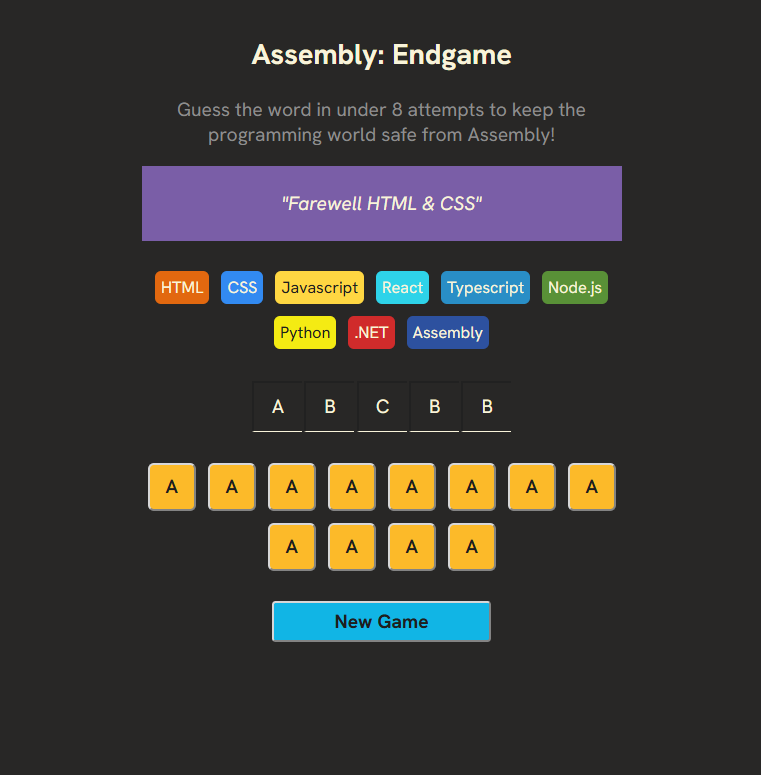

# Assembly Endgame

 * Project planning:
 * 
 * - What are the main containers of elements I need in this app?
 *   Game header   
 *   Game Status
 *   List of languages
 *   Form Input
 *   Keyboard Keys
 *
 * - What values will need to be saved in state vs.
 *   what values can be derived from the state?
 * 
 * 
 * - How will the user interact with the app? What
 *   events do I need to handle?
 *   Mouse & Keyboard events
 * 

 Update the keyboard when a letter is right or wrong
 Display only correct guessed letters
 Guess the wrong letter count
 Lost languages
 GameOver